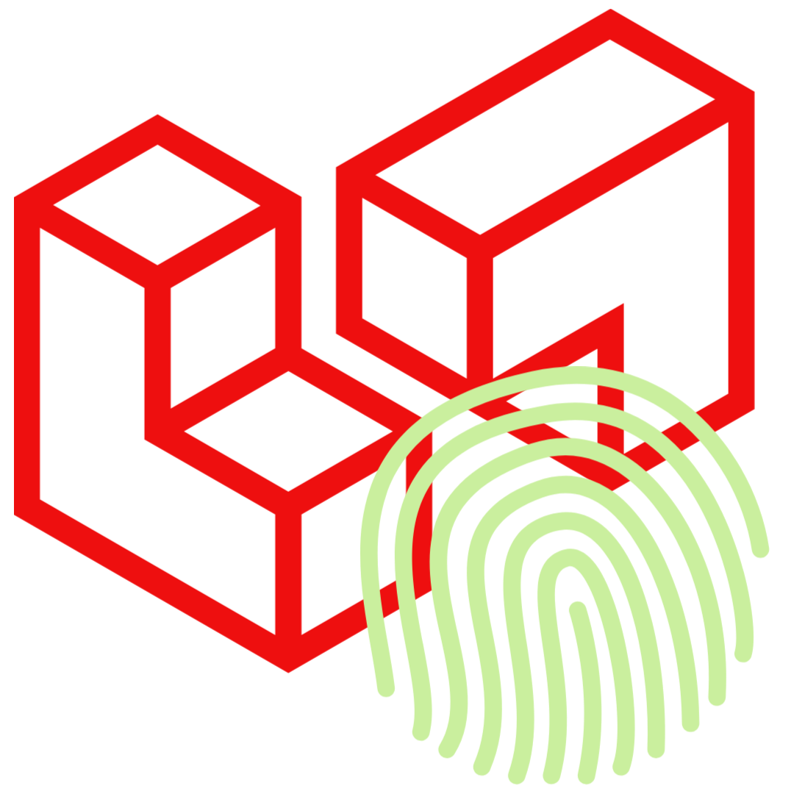

# Welcome to W3Proof 

{ width="60" }
An Exploration of exploiting **formal proofs** as a source of trust on the web &rarr; an exploration of mechanisms for sharing **formal proofs** in a *distributed* and *trusted* manner: an attempt to build a [distributed and trusted web of formal proofs](https://hal.archives-ouvertes.fr/hal-02468229/).

Quoting from [W3Proof](https://www.inria.fr/en/w3proof): 

> "While the World Wide Web provides universal methods for publishing documents, the only form of trust provided is that of reputation: that is, one might be willing to trust assertions on a web page that are cryptographically signed by trusted agents.  The W3Proof project proposes to develop an additional global and permanent source of trust by exploiting formal proof as well as the principles of transparency and reproducibility.  Instead of viewing assertions and their proof evidence as existing in libraries of various proof assistants, we envision a highly distributed network of such assertions that a skeptic can recheck if desired.  Concepts from distributed computing and cryptography will be central components to W3Proof."

-----------------

This project is an ['Exploratory Action'](https://www.inria.fr/en/w3proof) proposed and initiated by [Dale Miller](http://www.lix.polytechnique.fr/Labo/Dale.Miller/) at [Inria Saclay](https://www.inria.fr/en/inria-saclay-centre).

An 'Exploratory Action' is a term coined by [Inria](https://www.inria.fr/en/inria-saclay-centre) to refer to projects attempting to explore new research themes relative to Inria's usually addressed themes in computer science and which might extend to other areas of knowledge.

For more details on the project's idea, refer to [Towards an internet of proof?](https://www.inria.fr/en/towards-internet-proof)